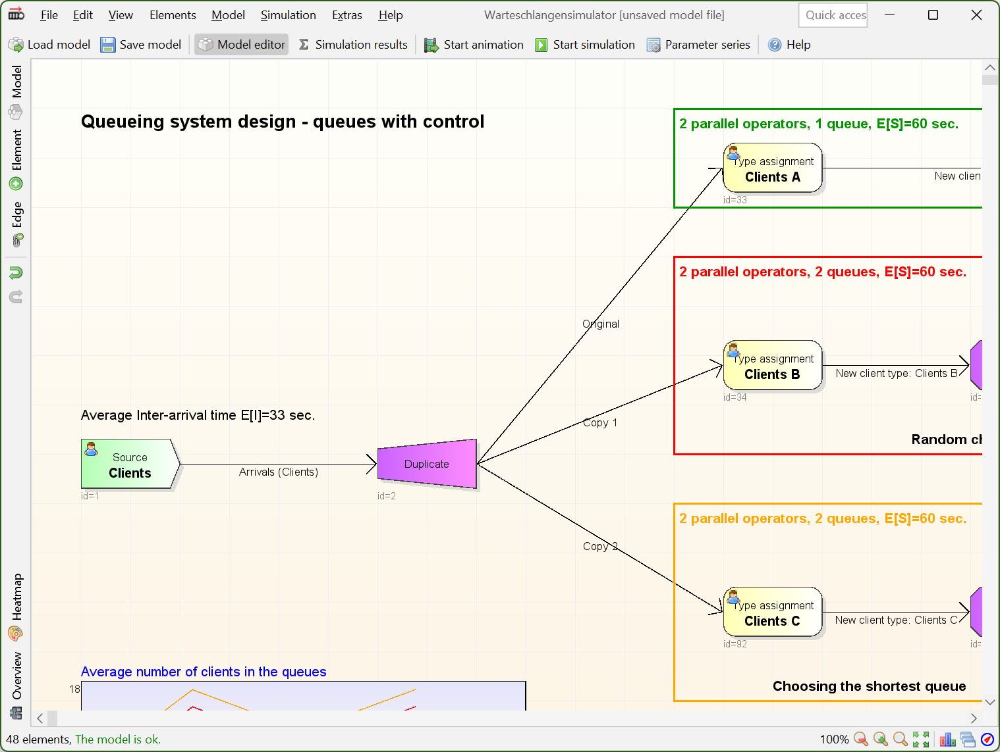
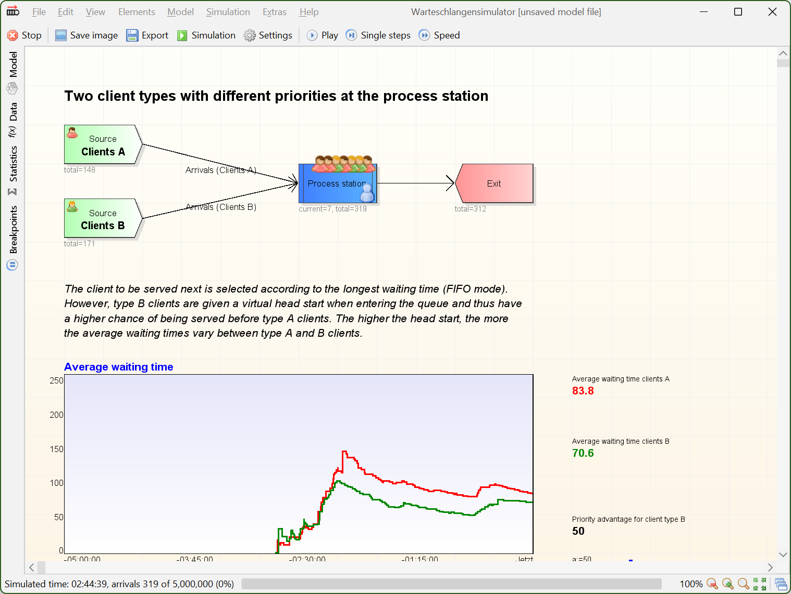
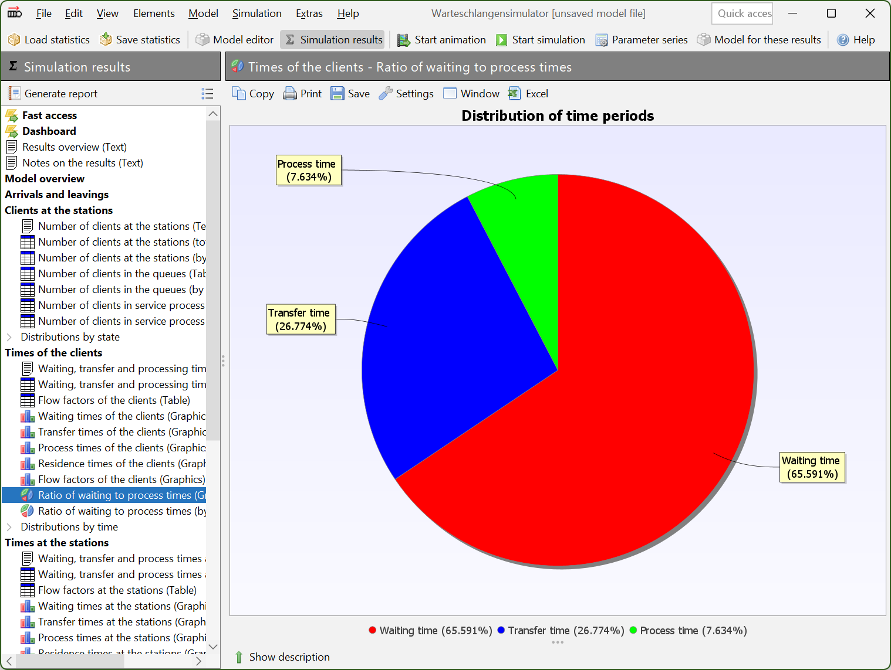
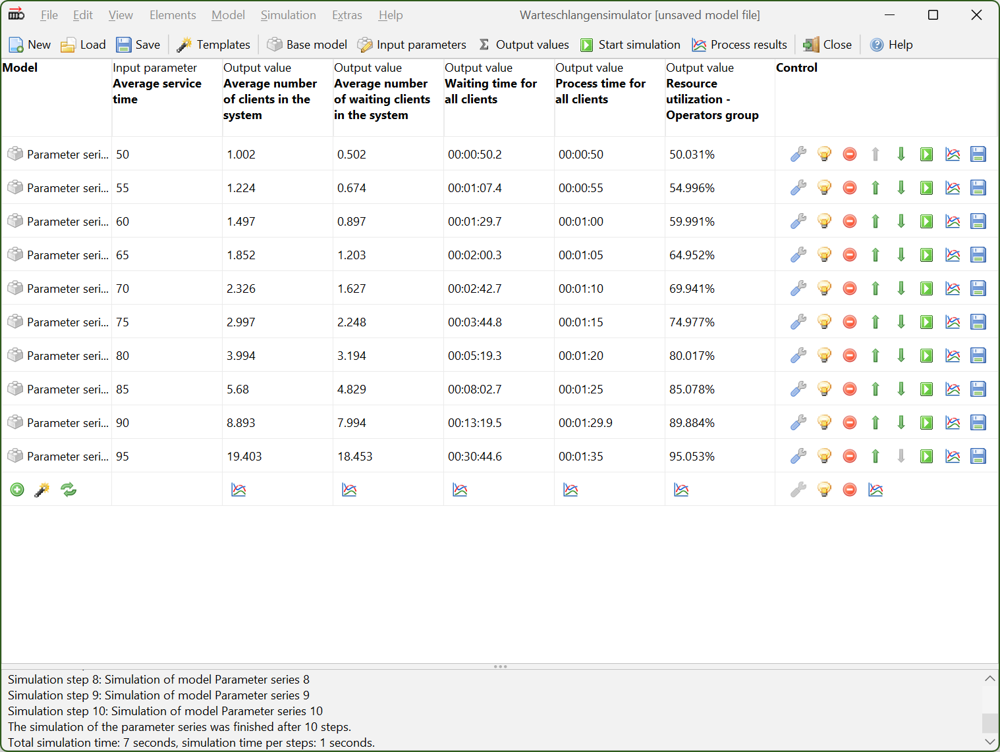
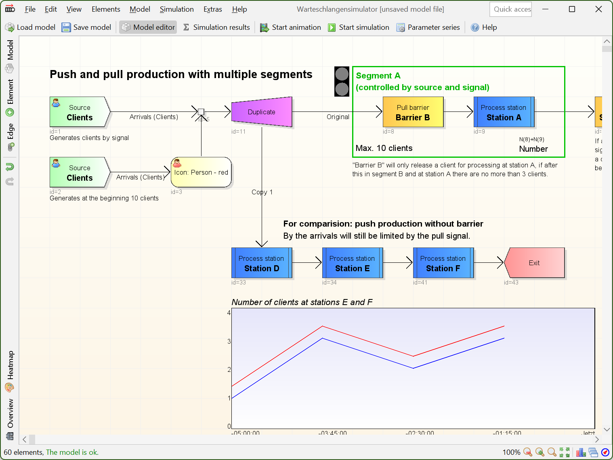

# Warteschlangensimulator

([Deutsche Version dieser Readme.](README_de.md))

Warteschlangensimulator is a free, platform independent, [event-driven, stochastic simulator](https://en.wikipedia.org/wiki/Discrete-event_simulation "Wikipedia").

In the simulator, queueing systems can be modelled and afterwards be simulated in form of flowcharts. During the simulation an optional animation of the processes in the model can be shown. Following a simulation, a large number of indicators are available for statistical evaluation. The simulator can be used both interactively and in command line mode. Functions for the automated execution of parameter studies are also available.

## Download

* **[Windows installer](https://github.com/A-Herzog/Warteschlangensimulator/releases/latest/download/SimulatorSetup.exe)**
* **[Zip file](https://github.com/A-Herzog/Warteschlangensimulator/releases/latest/download/Simulator.zip)** (for use under Windows, Linux, ...)
* [Source code](https://github.com/A-Herzog/Warteschlangensimulator/releases/latest/) ([Notes on the build process](BUILD.md))

The Windows version can be installed with or without admin rights. The zip file version can be used on any platform without installation.

* [Release notes](https://github.com/A-Herzog/Warteschlangensimulator/wiki/Release-notes "Release notes and plans in the GitHub Wiki")
* System requirements: [Java 11 or higher](https://adoptium.net/ "Download Java from adoptium.net")
* License: [Apache License 2.0](https://www.apache.org/licenses/LICENSE-2.0) (for Warteschlangensimulator, the used libraries are partly subject to different open source licenses)

## Key features

🌏 Extensive modelling capabilities (>100 different station types)

🚀 Fast simulation (>100.000 arrivals/second/core, multicore capable)

🎬 Animation of the models possible (incl. optional recording as video)

✅ Statistics recording (automatic recording of all indicators)

💻 Flexible usage (graphical interface or server mode, platform independent)

❓ Support (online help for all stations and explanations of the statistics, interactive tutorial)

💬 Languages: English and German available

⭐ Free software

## Help and support

* Warteschlangensimulator has an integrated online help, various example models and an interactive tutorial.
* [Short introduction to Warteschlangensimulator](https://a-herzog.github.io/Warteschlangensimulator/Warteschlangensimulator-en.pdf) (pdf)
* [Tutorial in pictures](https://a-herzog.github.io/Warteschlangensimulator/Warteschlangensimulator-Tutorial-en.pdf) (pdf)																														  																																						  
* [Wiki about Warteschlangensimulator](https://github.com/A-Herzog/Warteschlangensimulator/wiki)
* [Introduction **slides** for Warteschlangensimulator](https://a-herzog.github.io/Warteschlangensimulator/IntroducingWarteschlangensimulator.pdf) (pdf)
* [Introduction **videos** for  Warteschlangensimulator](https://github.com/A-Herzog/Warteschlangensimulator/wiki/Videos)
* [Feature overview **slides** for Warteschlangensimulator](https://a-herzog.github.io/Warteschlangensimulator/Warteschlangensimulator-Features.pdf) (pdf)
* [**Textbook**: "Simulation mit dem Warteschlangensimulator" (in German)](https://www.springer.com/gp/book/9783658346676)
* Stay informed: You can follow this project on GitHub to get updates about new versions etc.

---

## Application fields

In all production and logistics processes where **uncertainties** occur (unknown arrival times of customers, variable service times, failure of resources ...) waiting times occur. The better these relationships are understood, the better unnecessary waiting times can be avoided. If only average values are calculated, these problems cannot be detected. In relation to the average service time, the available service capacity at the supermarket checkouts is usually sufficient - and yet unpleasant waiting times often occur.

If a service process consists not only of one station, but of an entire **network** including feedback and complex branching rules - which is the normal case in many production processes - it is no longer possible to identify which stations are the actual bottlenecks only on the basis of static calculations.
With the help of a simulation model, the relevant characteristics of a real production or logistics process can be depicted and simulated on the computer. This includes stochastic service times as well as branching and networked processes, complex rules for controlling the release of workpieces, resources with variable availability (shift schedules and also unexpected failures) and dependencies between different stations.

Making changes or extensions to a real production system is usually associated with high risks and costs. With the help of a simulation model, the effects of changes to a system can be safely examined and an optimal control strategy can be determined.

**Target user groups**

* 🧬 **Research** (Creation of complex models, recording of all characteristics common in queuing theory, automation of parameter studies, ...)
* 🏫 **Teaching** (Support in creating simple models, easy comparison of simulation and analytical results, descriptions for all statistical outputs)
* 🏭 **Industry** (Platform independence, usage of standard file formats, command line controllable, definition of templates for reporting outputs)

---

## Features

Warteschlangensimulator enables modeling, simulation and optimization of many questions from the field of production planning. Especially problems in the area of production and logistics systems can be analyzed very well with the help of Warteschlangensimulator.

#### Modelling of queuing systems in the form of flowcharts
  

Complex production and logistics processes can easily be modelled for simulation in Warteschlangensimulator in the form of flowcharts. 
 

#### Animation

All queueing models created as flowchart can be visualized as animation. During the animation the changes in certain values can be followed live (both in the form of text values and in the form of continuously updated diagrams). Certain station types can be used to directly intervene in the control system during a running simulation.
 

#### Statistics recording

  
During the simulation of a model, all relevant performance indicators are automatically recorded and are available for evaluation when the simulation is completed. For easy further processing of the data, Warteschlangensimulator uses open file formats, but can also export e.g. tables in formats for common spreadsheet applications.
 

#### Automation of studies

To investigate the effects of changes in individual parameters, these can be varied automatically within a certain range and the simulation results for these parameter series can be displayed in table or graphic form.
 

#### Queueing networks and complex control strategies

Branching and barriers can be modelled using complex rules that go far beyond the possibilities of analytical models. Even user-defined scripts can be used to delay or branch customers.
  
  
---
  
## Modeling capabilities

Warteschlangensimulator provides 100 different template elements for creating the queueing models.

([More detailed description of the available elements](README_MODELING_en.md))

---

## Automation of simulations

In many cases one is not only interested in the simulation results for an individual queueing model, but also wants to investigate the quantitative effects of the change of a parameter on the characteristics of the system. This can have two possible reasons:

* An understanding of the interactions within the system should be gained.
* A parameter (e.g. the total yield of the system) is to be optimized.

In both cases many simulations of a slightly varied model are necessary.

#### Parameter series

If only one or more parameters are to be varied and the results recorded in each case, this can be done automatically using the parameter series function: Only the input parameters and their respective variation ranges have to be defined and it has to be specified which parameters are to be recorded. Warteschlangensimulator then does the rest automatically. The result is a table in which the input parameters are compared with the respective characteristics. This table can be further processed in a spreadsheet, for example - but can also be visualized directly in Warteschlangensimulator as a diagram. What-if questions can be answered very comfortably, with little effort for the user and particularly very quickly.

#### Optimization

If it is already known which characteristic value is to be optimized and by varying which parameters in which range this is to be done, the optimizer built into Warteschlangensimulator can be used. In addition to the classical methods for the variation of the parameters, **genetic algorithms** are also available here.

#### Client server operation

Warteschlangensimulator can be started on a performant system in server mode. If a client installation is **connected** to this server, all simulations are performed completely transparently on the server.

Alternatively, parameter series configurations can be saved and then executed via **command line** on a calculation server without any graphical interface.

### Textbook: "Simulation mit dem Warteschlangensimulator" (in German)

[A. Herzog: "Simulation mit dem Warteschlangensimulator"](https://www.springer.com/gp/book/9783658346676) (in German)

Citing "Simulation mit dem Warteschlangensimulator" using BibTeX:

    @book{herzog2021simulation,
      title={Simulation mit dem Warteschlangensimulator},
      author={Herzog, Alexander},
      year={2021},
      publisher={Springer},
      location={Wiesbaden},
      doi={10.1007/978-3-658-34668-3}
    }
	
The examples shown in the textbook are also available as Warteschlangensimulator models from within the program and also from the
[GitHub textbook examples page](https://github.com/A-Herzog/Warteschlangensimulator/tree/master/Simulator/src/main/java/ui/help/bookexamples).

### Publication list

A list of all publications on Warteschlangensimulator can be found on the [Publication list GitHub Wiki](https://github.com/A-Herzog/Warteschlangensimulator/wiki/Publication-list) page.