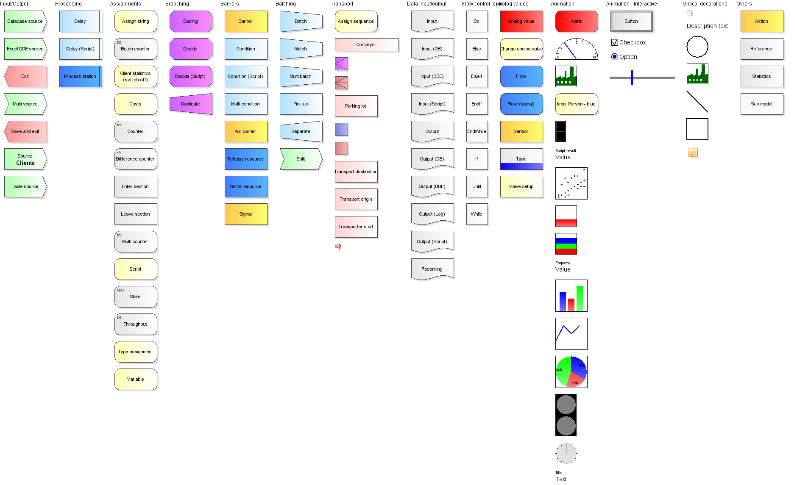

# Available element types in Warteschlangensimulator

### Client sources

Every queueing model can consist of any number of sources where customers (which can also be workpieces etc.) arrive.

* Customers can arrive individually or in groups (batch arrivals).
* Arrival times can be defined using probability distributions or mathematical expressions, or can be loaded from tables or databases.
* Arrivals can also take place in response to signals triggered, for example, by process stations etc.
* Sources can generate customers of different types, which  move along different paths through the system (for example, different model variants in a production line) and are displayed separately in the statistics.

### Process stationen

Process stations are the core elements of almost every queueing model. At them, customers are served by operators. The operators can also be machines or tools.

* The service times can vary per customer type and can be defined by distributions or calculation expressions.
* In front of each process station there is a queue. The length of the queue can be queried by other stations, so that customers may only be released when there is space available in the respective queue.
* One or more resources (operators) may be required to serve a customer. The available resources are defined globally and can possibly be shared between different process stations.
* Customers can be served individually or in groups (batch service).
* After serving a customer, it may be necessary for an operator to go into a post-processing phase. In addition, setup times can occur when changing the customer type at a station.
* Customers of different types can have different priorities. In addition, a priority can also be defined within a customer type on the basis of a formula, so that operating rules differing from the FIFO principle are possible.
* Customers can be impatient and leave the station without being served if they had to wait too long.

### Branching

A standard problem in many production processes which cannot be analyzed by using classical queueing theory is the branching of customers which is needed to model many production networks.

In Warteschlangensimulator, customers can be branched in different directions based on a wide variety of properties. This includes:

* Branching according to the customer type
* Branching according to system characteristics (e.g. to the currently least loaded process station)
* Balanced utilization of several process stations (i.e. random branching according to predefined rates)

### Barriers

In many cases, customers are only allowed to enter certain areas of the system if certain conditions are met. Pull production is a good example: Only when the amount of material at a subsequent station has fallen below a threshold value may the source station deliver the next customer or the next workpiece. These and similar rules can be flexibly mapped in Warteschlangensimulator using barriers, signals and counters. 

### Batch processing

* Customers often arrive in groups in a system (e.g. in the form of components delivered by trucks) or machines can serve components in groups.
* It may also be necessary to form groups dynamically from one station to the next and also to dynamically dissolve groups again.
* In many production processes there are stations where certain production lines converge (e.g. engines are merged with car bodies). Such processes - and the problems associated with them - can also be examined in Warteschlangensimulator.

### Transports

If workpieces or customers are transported from one station to another with the help of transport resources, this not only takes time, but resources are required for the transport and the transport times can also depend on the respective route. Furthermore, there are often restrictions with regard to transport capacities. All these cases can be modelled in Warteschlangensimulator.

### Time continuous values

In classical event-driven simulation, no time continuous processes occur: All changes to the system occur abruptly at certain points in time. (First there is no customer in the system, then a customer arrives and is in the system. There is no smooth transition between 0 and 1 customer). Nevertheless, for some questions it is important to be able to map values that change continuously over time (for example, filling levels of tanks). Warteschlangensimulator therefore has a number of station types that can be used to map such processes.

### Transient behaviour

In classical queuing theory, processes are considered in the steady state, i.e. after a long runtime. For these cases, the inter-arrival times of customers are defined using probability distributions. Often, however, a system is to be examined at a certain point in time, and often time spans etc. are defined by concrete values (e.g. concrete arrival times of customers) or the parameters of the system (e.g. number of operators available at any given time) change at certain points in time (e.g. due to a shift schedule).

Such models are very difficult or even impossible to represent using analytical queueing theory. Warteschlangensimulator therefore provides extensive functions for modeling the transient phase:

* Shift schedules for resources
* Failures of resources after certain times or numbers of served customers (or even randomly)
* Definition of arrivals etc. based on tables or databases (with historical data)
* Recording of changes in values over time in the statistics

### Documentation

* [Overview of all station types](https://a-herzog.github.io/Warteschlangensimulator/Warteschlangensimulator-Reference-en.pdf) (pdf)