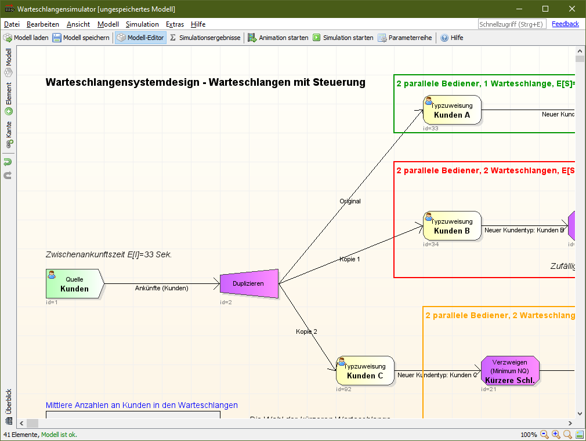
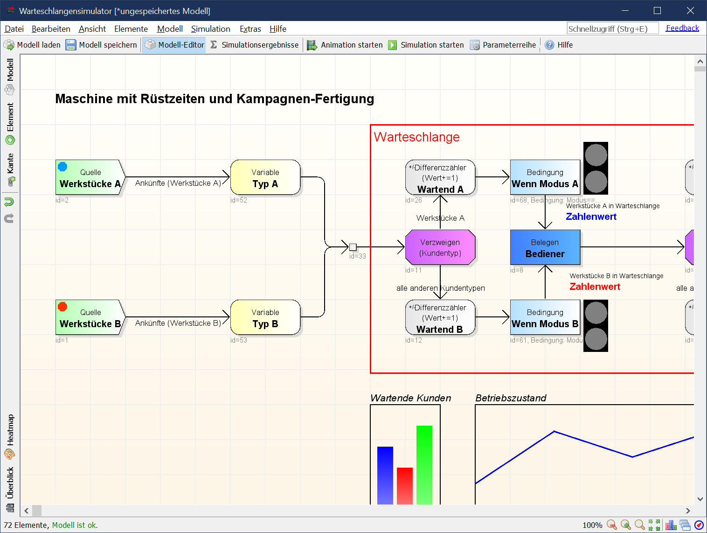
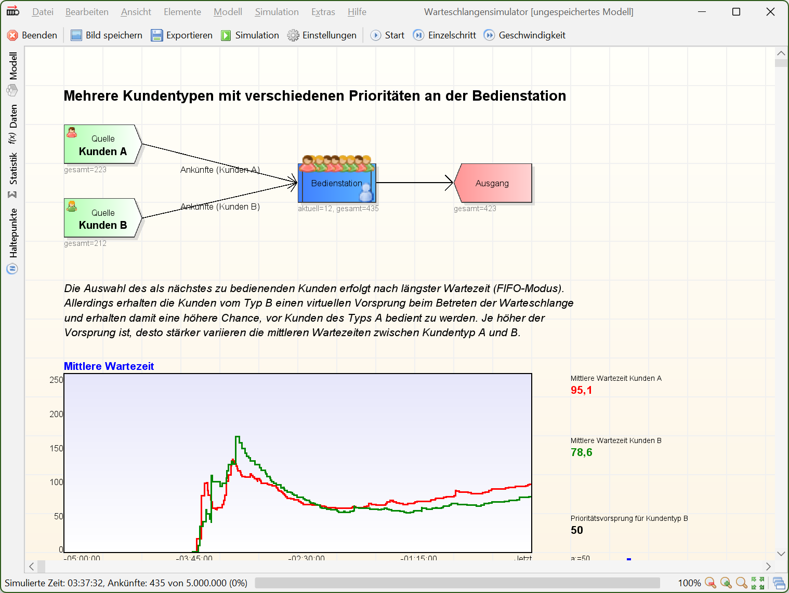
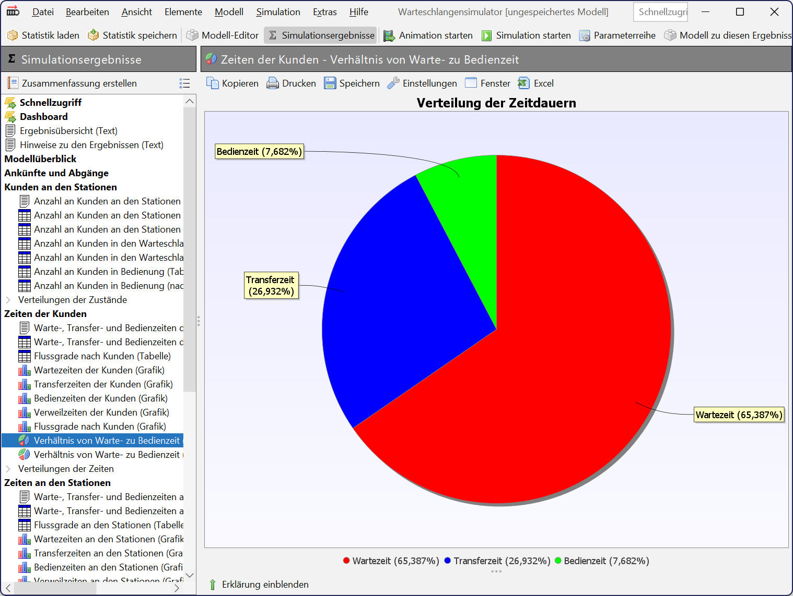
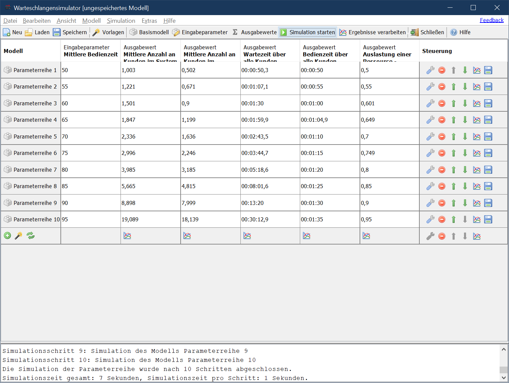
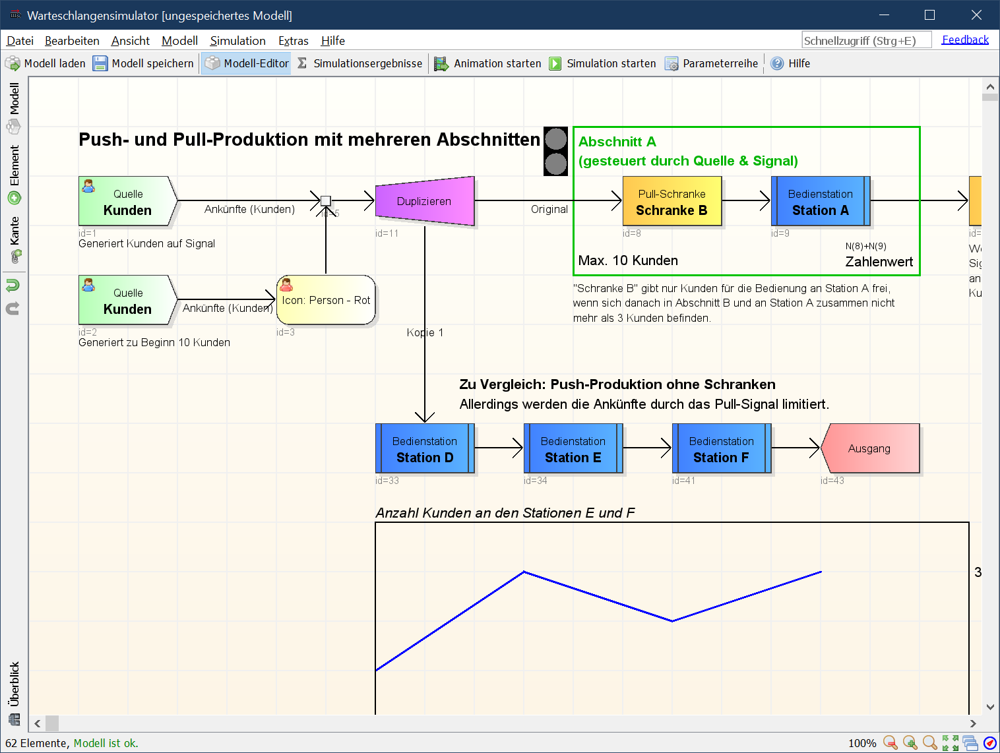
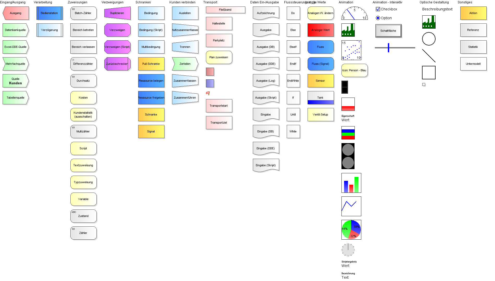

# Warteschlangensimulator

([English version of this readme.](README_en.md))

Der Warteschlangensimulator ist ein freier, plattformunabhängiger, [ereignisorientierter, stochastischer Simulator](https://en.wikipedia.org/wiki/Discrete-event_simulation "Wikipedia").

Im Simulator können Warteschlangenmodelle in Form von Fließbildern modelliert und anschließend simuliert werden. Während der Simulation kann optional eine Animation der Prozesse in dem Modell dargestellt werden. Im Anschluss an eine Simulation stehen eine Vielzahl an Kenngrößen für die statistische Auswertung zur Verfügung. Der Simulator kann sowohl interaktiv als auch im Kommandozeilenbetrieb verwendet werden. Auch stehen Funktionen zur automatisierten Durchführung von Parameterstudien zur Verfügung.

**Checkliste**

🌏 Großes Modellierungsvermögen (>100 verschiedene Stationstypen)

🚀 Schnelle Simulation (>100.000 Ankünfte/Sekunde/Kern, mehrkernfähig)

🎬 Animation der Modelle möglich (inkl. optionaler Aufzeichnung als Video)

✅ Statistikerfassung (automatische Erfassung aller Kenngrößen)

💻 Flexibel einsetzbar (grafische Oberfläche oder Servermodus, plattformunabhängig)

❓ Unterstützung (Online-Hilfe zu allen Stationen und Erklärungen in der Statistik, interaktives Tutorial)

💬 Sprachen: Deutsch und Englisch verfügbar

⭐ Freie Software

## Download

* [Windows-Installer](https://github.com/A-Herzog/Warteschlangensimulator/releases/latest/download/SimulatorSetup.exe)
* [zip-Datei](https://github.com/A-Herzog/Warteschlangensimulator/releases/latest/download/Simulator.zip) (nutzbar unter Windows, Linux, MacOS, ...)
* [Quellcode](https://github.com/A-Herzog/Warteschlangensimulator/releases/latest/) ([Hinweise zum Build-Prozess](BUILD.md))

Die Windows-Version kann sowohl mit als auch ohne Admin-Rechte installiert werden. Die zip-Datei-Variante kann auf jeder Plattform ohne Installation verwendet werden.

* Systemvoraussetzung: [Java 8 oder höher](https://adoptopenjdk.net/ "Java von adoptopenjdk.net herunterladen")
* Lizenz: [Apache License 2.0](https://opensource.org/licenses/Apache-2.0) (für den Warteschlangensimulator, die verwendeten Bibliotheken unterliegen zum Teil abweichenden Opensource-Lizenzen)

## Hilfe und Unterstützung

* Der Warteschlangensimulator verfügt über eine integrierte Online-Hilfe, diverse Beispielmodelle und ein interaktives Tutorial.
* [Kurzeinführung Warteschlangensimulator](https://a-herzog.github.io/Warteschlangensimulator/Warteschlangensimulator-de.pdf) (pdf)
* [Tutorial in Bildern](https://a-herzog.github.io/Warteschlangensimulator/Warteschlangensimulator-Tutorial-de.pdf) (pdf)																														  
* [Wiki zum Warteschlangensimulator](https://github.com/A-Herzog/Warteschlangensimulator/wiki) (Englisch)
* [**Präsentation** zur Vorstellung des Warteschlangensimulator](https://a-herzog.github.io/Warteschlangensimulator/IntroducingWarteschlangensimulator.pdf) (Englisch, pdf)
* [**Videos** zur Vorstellung des Warteschlangensimulator](https://github.com/A-Herzog/Warteschlangensimulator/wiki/Videos) (Englisch)
* Auf dem Laufenden bleiben: Sie können diesem Projekt auf GitHub folgen, um stets über neue Versionen usw. benachrichtigt zu werden.

---

## Anwendungsgebiete

In allen Produktions- und Logistikprozessen, in denen **Unsicherheiten** auftreten (unbekannte Ankunftszeiten der Kunden, variable Bedienzeiten, Ausfälle von Ressourcen ...) treten Wartezeiten auf. Je bessere diese Zusammenhänge verstanden sind, desto besser lassen sich unnötige Wartezeiten vermeiden. Wird nur mit Mittelwerten gerechnet, so lassen sich diese Probleme nicht erkennen. Bezogen auf die mittlere Bediendauer reicht die verfügbare Bedienleistung an den Supermarktkassen meist aus - und trotzdem entstehen häufig unerfreuliche Wartezeiten.

Besteht ein Bedienprozess nicht nur aus einer Station, sondern aus einem ganzen **Netz** inkl. Rückkopplungen und komplexen Verzweigungsregeln - was in vielen Produktionsprozessen den Normalfall darstellt - ist nur auf Basis von statischen Rechnungen überhaupt nicht mehr erkennbar, welche Stationen die eigentlichen Engpässe darstellen.
Mit Hilfe eines Simulationsmodells lassen sich die relevanten Eigenschaften eines realen Produktions- oder Logistikprozesses abbilden und am Computer simulieren. Dies beinhaltet sowohl stochastische Bedienzeiten als auch Verzweigungen und vernetzte Prozesse, komplexe Regeln zur Steuerung der Freigabe von Werkstücken, Ressourcen mit variabler Verfügbarkeit (Schichtpläne und auch unerwartete Ausfälle) und Abhängigkeiten zwischen verschiedenen Stationen.

Änderungen oder Erweiterungen an einem realen Produktionssystem vorzunehmen, ist meist mit hohen Risiken und Kosten verbunden. Mit Hilfe eines Simulationsmodells lassen sich die Auswirkungen von Änderungen an einem System gefahrlos und untersuchen und es lässt sich so eine optimale Steuerungsstrategie ermitteln.

**Zielgruppen**

* 🧬 **Forschung** (Erstellung komplexer Modelle, Erfassung aller in der Warteschlangentheorie üblichen Kenngrößen, Automatisierung von Parameterstudien, ...)
* 🏫 **Lehre** (Unterstützung bei der Erstellung einfacher Modelle, einfacher Vergleich von Simulations- und analytischen Ergebnissen, Hilfetexte zu allen Statistikausgaben)
* 🏭 **Unternehmenseinsatz** (Plattformunabhängigkeit, Verwendung von Standard-Dateiformaten, kommandozeilensteuerbar, Festlegung von Vorlagen für Reporting-Ausgaben)

---

## Features

Der Warteschlangensimulator ermöglicht die Modellierung, Simulation und Optimierung beliebiger Fragestellungen ausdem Bereich der Produktionsplanung. Insbesondere Probleme im Bereich von Produktions- und Logistiksystemen lassen sich mit Hilfe des Warteschlangensimulators sehr gut analysieren. 

#### Modellierung von Warteschlangensystemen in Form von Fließbildern
  
  
Komplexe Produktions- und Logistikprozesse können im Warteschlangensimulator auf einfache Weise in Form von Fließbildern als Simulationsmodelle abgebildet werden.
[Mehr Informationen](#ModelingCapabilities)
 

#### Animation

Alle als Fließbild angelegten Warteschlangenmodelle können als Animation dargestellt werden. Während der Animation kann die Entwicklung von bestimmten Werten live verfolgt werden (sowohl in Form von Textwerten als auch in Form von laufend aktualisierten Diagrammen). Über bestimmte Stationstypen kann während einer laufenden Simulation direkt in die Steuerung eingegriffen werden.
 

#### Statistikaufzeichnung

  
Während der Simulation eines Modells werden automatisch alle relevanten Kenngrößen aufgezeichnet und stehen nach Abschluss der Simulation zur Auswertung zur Verfügung. Zur einfachen Weiterverarbeitung der Daten setzt der Warteschlangensimulator auf offene Dateiformate, kann aber z.B. Tabellen auch in Formaten für übliche Tabellenkalkulationen exportieren.
 

#### Automatisierung von Untersuchungen

Zur Untersuchungen der Auswirkungen von Veränderungen einzelner Parameter können diese automatisiert in einem bestimmten Bereich variiert werden und die Simulationsergebnisse in Tabellen- oder Grafikform dargestellt werden.
[Mehr Informationen](#Automation)
 

#### Netze und komplexe Steuerungsregeln

Verzweigungen und Schranken können über komplexe Regeln, die weit über die Möglichkeiten analytischer Modelle hinausgehen, abgebildet werden. Es können dabei sogar nutzerdefinierte Skripte zur Vetzögerung oder Verzweigung von Kunden verwendet werden.
  
  
---
  
## Modellierungsmöglichkeiten

Im Warteschlangensimulator stehen 100 verschiedene Vorlagenelemente zur Erstellung der Warteschlangenmodelle zur Verfügung.

([Detailliertere Beschreibung der verfügbaren Elemente](README_MODELING_de.md))

---

##  Automatisierung von Simulationen

In vielen Fällen interessiert man sich nicht nur für die Simulationsergebnisse zu einem Warteschlangenmodell, sondern möchte untersuchen, welche quantitativen Auswirkungen die Veränderung eines Parameters auf die Kenngrößen des Systems hat. Dies kann zwei mögliche Gründe haben:

* Es soll ein Verständnis für die Wirkzusammenhänge innerhalb des Systems gewonnen werden.
* Es soll eine Kenngröße (z.B. der Gesamtertrag des Systems) optimiert werden.

In beiden Fällen sind viele Simulationen eines jeweils leicht variierten Modells notwendig.

#### Parameterreihen

Sollen lediglich ein oder mehrere Parameter variiert werden und jeweils die Ergebnisse aufgezeichnet werden, so kann dies mit Hilfe der Parameterreihenfunktion automatisiert erfolgen: Es müssen jeweils nur die Eingabeparameter und ihre jeweiligen Variationsbereiche definiert werden und es muss festgelegt werden, welche Kenngrößen jeweils aufgezeichnet werden sollen. Den Rest führt der Warteschlangensimulator dann selbstständig durch. Als Ergebnis wird eine Tabelle, in der die Eingabeparameter den jeweiligen Kenngrößen gegenübergestellt werden, geliefert. Diese kann z.B. in einer Tabellenkalkulation weiterverarbeitet werden - aber kann auch direkt im Warteschlangensimulator als Diagramm visualisiert werden. Was-wäre-wenn-Fragestellungen lassen sich auf diese Weise sehr konfortabel, mit wenig Aufwand für den Anwender und vor allem auch sehr schnell beantworten.

#### Optimierung

Ist bereits bekannt, welche Kenngröße optimiert werden soll und durch die Variation welcher Parameter in welchem Bereich dies erfolgen soll, so kann der in den Warteschlangensimulator eingebaute Optimierer verwendet werden. Neben den klassischen Methoden zur Variation der Parameter stehen hier auch **genetische Algorithmen** zur Verfügung.

#### Client-Server-Betrieb

Der Warteschlangensimulator kann auf einem leistungsstarken System im Servermodus gestartet werden. Wird eine Client-Installation mit diesem Server **verknüpft**, so erfolgen alle Simulationen vollkommen transparent auf dem Server.

Alternativ können Parameterreihenkonfigurationen gespeichert und dann per **Kommandozeile** auf einem Rechenserver ohne jegliche grafische Oberfläche ausgeführt werden.

