# Warteschlangensimulator Tutorial

In diesem Tutorial wird gezeigt, wie ein einfaches M/M/c Warteschlangensmodell mit E[I]=50, E[S]=80 und c=2 im Warteschlangensimulator erstellt werden kann.

***

## Schritt 1

Im Warteschlangensimulator können Bediensystem in Form von Fließbildern modelliert werden. Das Beispielmodell soll aus einer Quelle, einer Bedienstation und einem Ausgang bestehen. Um diese auf der Zeichenfläche hinzuzufügen, muss die Vorlagenleiste durch das Anklicken von "Element" auf der linken Symbolleiste geöffnet werden.

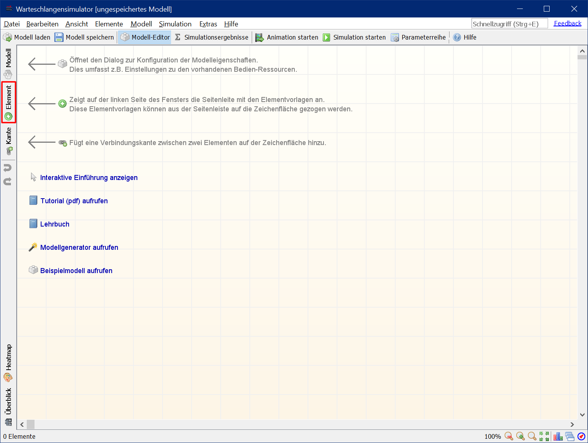

***

## Schritt 2

Die Elemente "Quelle", "Bedienstation" und "Ausgang" müssen auf die Zeichenfläche gezogen werden.

***

## Schritt 3

Danach kann die Vorlagenleiste durch erneutes Anklicken von "Element" wieder geschlossen werden.

***

## Schritt 4

Als nächstes müssen die drei Stationen verbunden werden. Kunden entstehen an der Quelle und sollen zur Bedienstation geleitet werden. Nach der Bedienung sollen sie das System an der Ausgang-Station verlassen. Um die Funktion zum Hinzufügen von Verbindungen zu aktivieren, muss die "Kante"-Schaltfläche auf der linken Symbolleiste geöffnet angeklickt werden.

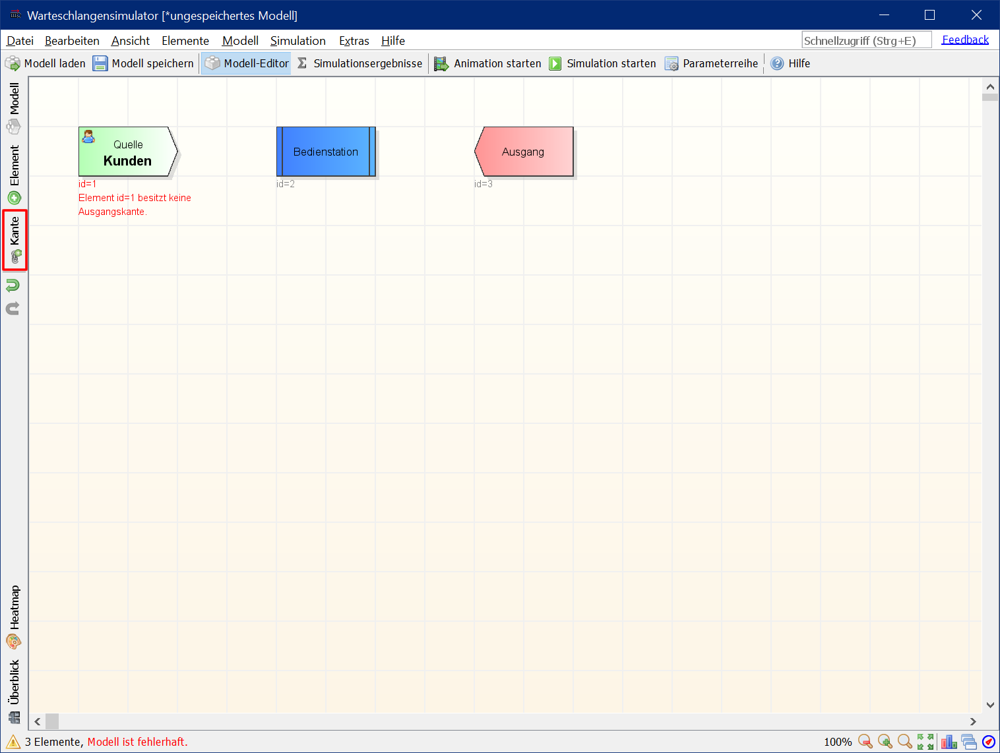

***

## Schritt 5

Kanten werden durch das Anklicken von Quell- und Zielstation der Verbindung hinzugefügt. D.h. es müssen nacheinander erst "Quelle" und dann "Bedienstation" angeklickt werden. Danach müssen "Bedienstation" und dann "Ausgang" angeklickt werden, um die zweite Kante hinzuzufügen.

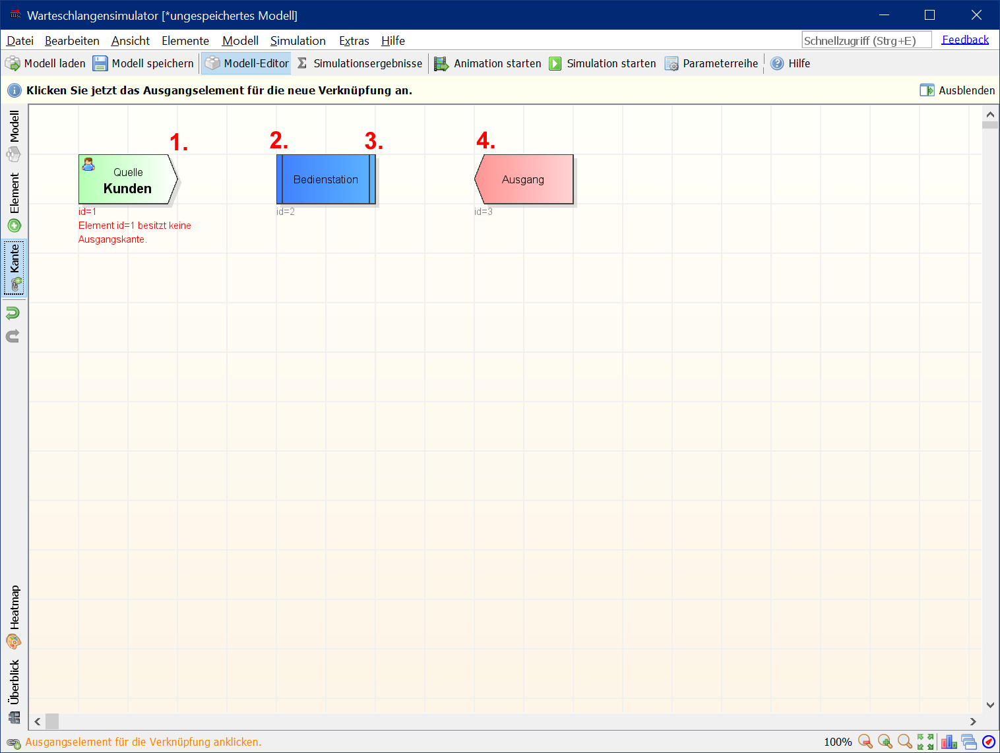

***

## Schritt 6

Nach dem Hinzufügen der Kanten kann die Funktion zum Hinzufügen von Verbindungen durch ein erneutes Anklicken von "Kante" auf der linken Symbolleiste beendet werden.

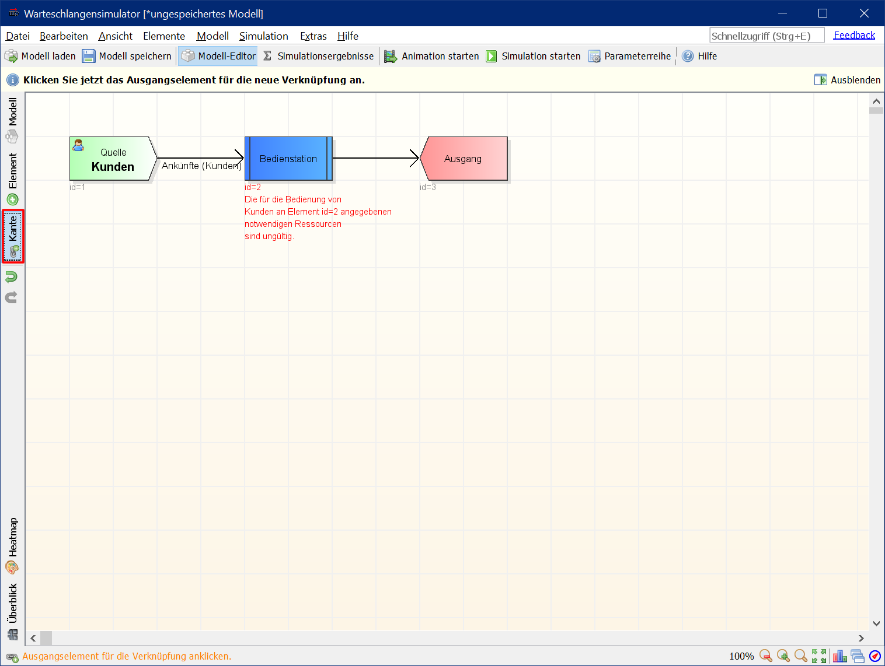

***

## Schritt 7

Nun müssen noch die Stationen konfiguriert werden. Um die Eigenschaften der Quelle zu konfigurieren, muss die "Quelle"-Station doppelt angeklickt werden.

***

## Schritt 8

Als Vorgabe ist die Exponentialverteilung mit einer mittleren Zwischenankunftszeit von 60 Sekunden eingestellt. In dem Beispielmodell soll eine **mittleren Zwischenankunftszeit von 50 Sekunden** verwendet werden, daher muss "Bearbeiten" angeklickt werden, um die mittlere Zwischenankunftszeit zu verändert.

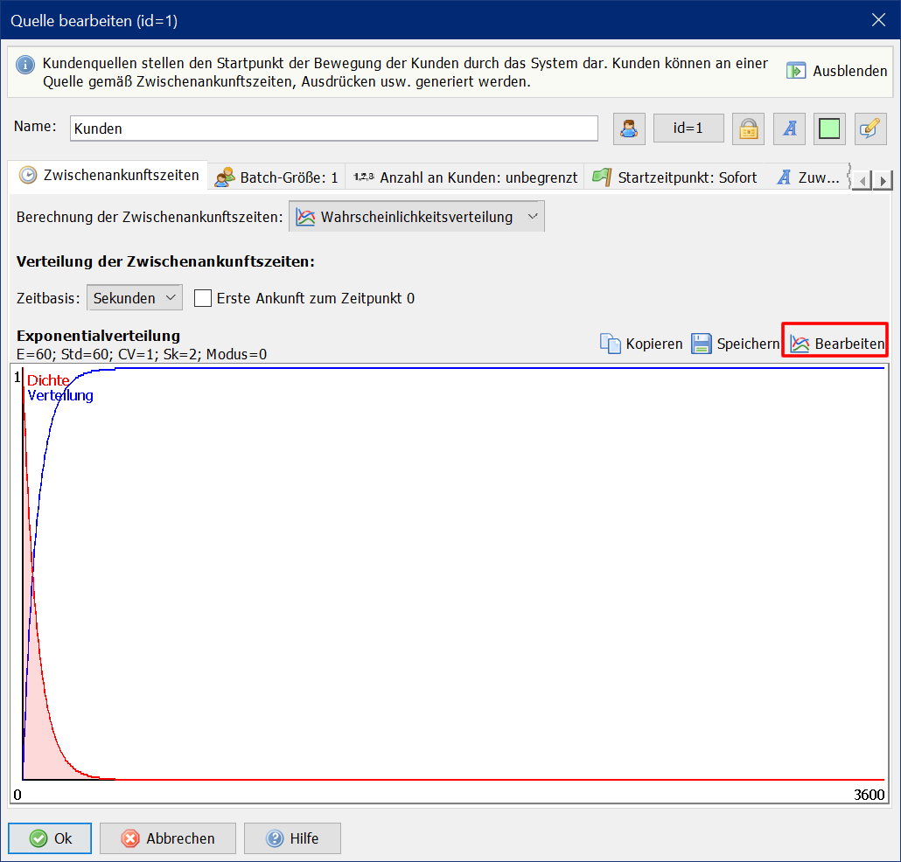

***

## Schritt 9

Nach dem Schließen des Verteilungseditors wird die neue Zwischenankunftszeit im Eigenschaftendialog der Kundenquelle angezeigt. Der Dialog kann jetzt durch Anklicken von "Ok" geschlossen werden.

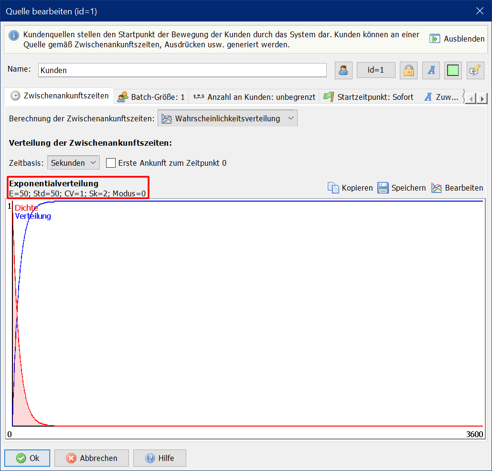

***

## Schritt 10

Als letztes muss noch die Bedienstation konfiguriert werden. Um die Eigenschaften der Bedienstation zu konfigurieren, muss das Bedienstation-Element doppelt angeklickt werden.

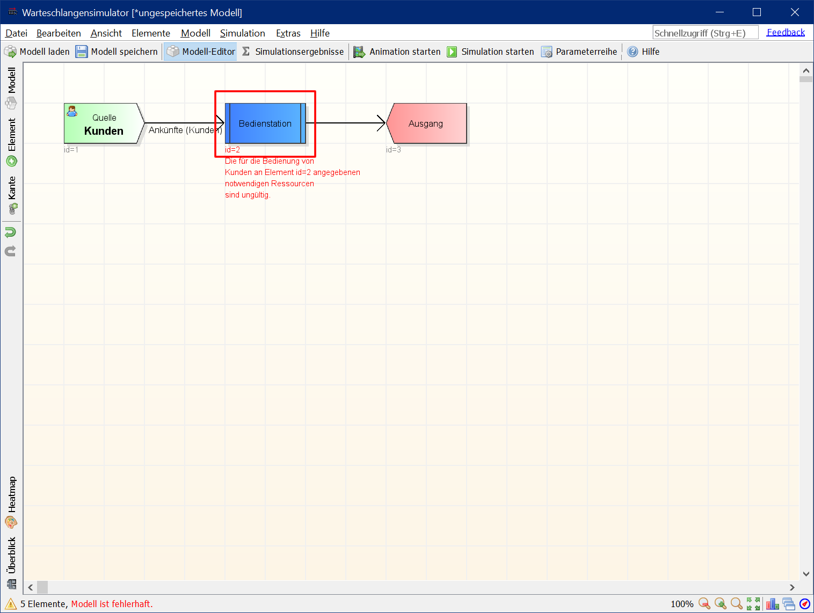

***

## Schritt 11

Als Vorgabe ist die Exponentialverteilung mit einer mittleren Bediendauer von 50 Sekunden eingestellt. In dem Beispielmodell soll eine **mittleren Bediendauer von 80 Sekunden** verwendet werden, daher muss "Bearbeiten" angeklickt werden, um die mittlere Bediendauer zu verändert.

***

## Schritt 12

Nach dem Schließen des Verteilungseditors wird die neue Bediendauer im Eigenschaftendialog der Bedienstation angezeigt. Damit die Bedienstation funktioniert, müssen nun noch Bediener hinzugefügt werden. Dafür muss die "Bediener"-Dialogseite aktiviert werden.

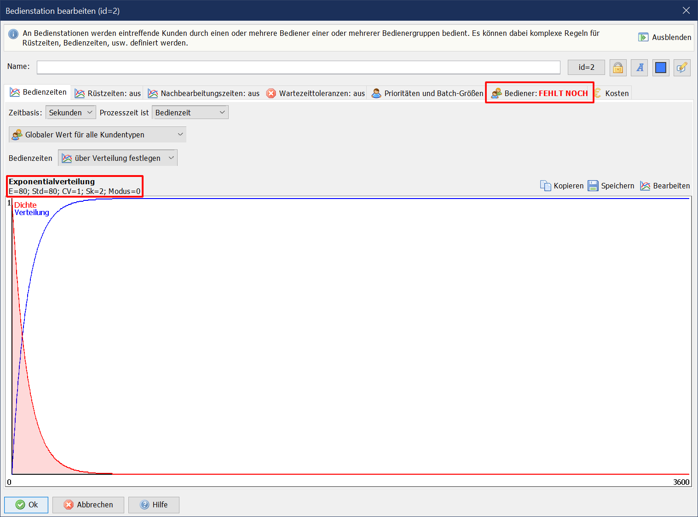

***

## Schritt 13

Im Ausgangsfall bedinden sich noch keine Bedienergruppen im System. Daher muss eine neue Bedienergruppe angelegt werden und der Bedienstation zugewiesen werden. Um dies zu erledigen, muss die Schaltfläche "Neue Bedienergruppe anlegen" angeklickt werden.

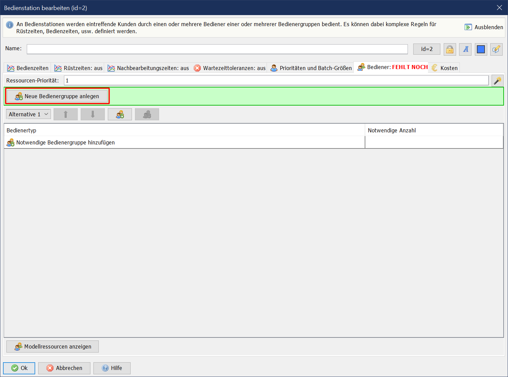

***

## Schritt 14

In dem Dialog zum Anlegen einer neuen Bedienergruppe kann die Gruppengröße (d.h. die Anzahl an vorhandenen Bedienern in der Gruppe) festgelegt werden. Da das Beispiel ein M/M/c System mit c=2 ergeben soll, soll hier eine **Gruppengröße von 2** gewählt werden.

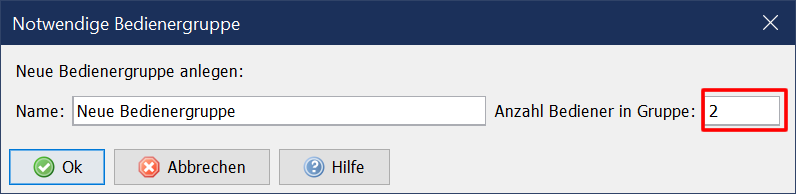

***

## Schritt 15

Zwei Bediener sind in der Gruppe verfügbar und jeweils ein Bediener wird benötigt, um einen Kunden zu bedienen. Damit ist das Modell vollständig. Der Dialog kann nun durch das Anklicken von "Ok" geschlossen werden.

***

## Schritt 16

Durch das Anklicken von "Animation starten" oder "Simulation starten" in der Symbolleiste kann nun die Animation oder die Simulation des Modells begonnen werden.

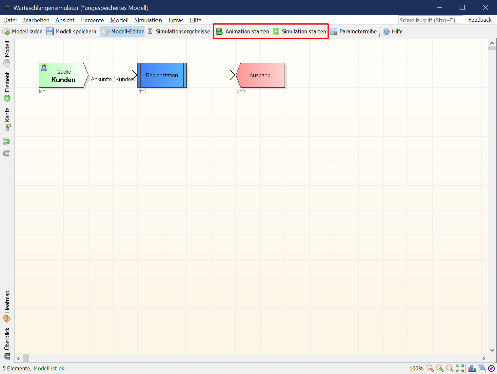