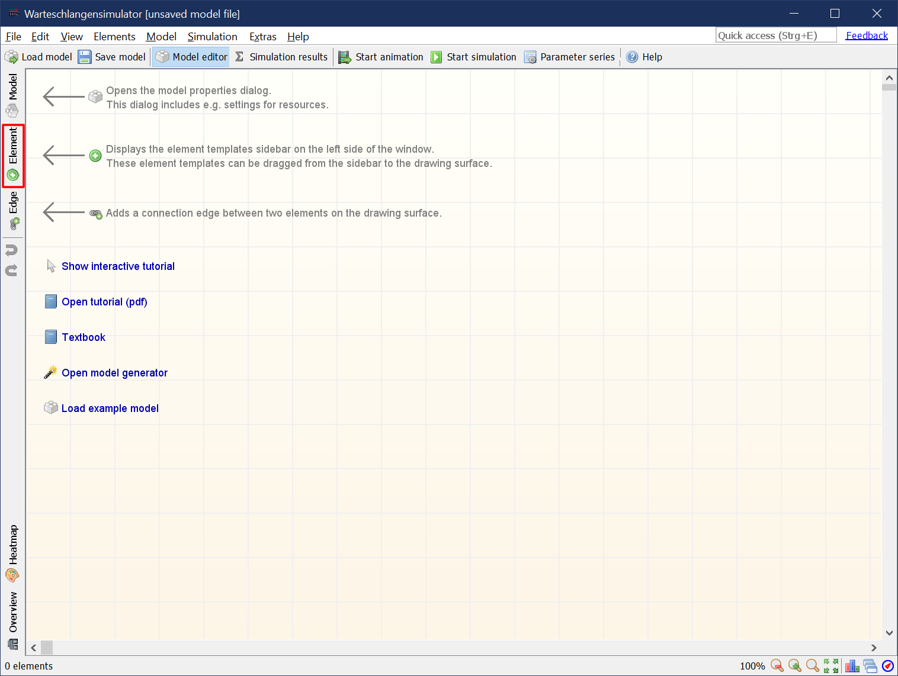
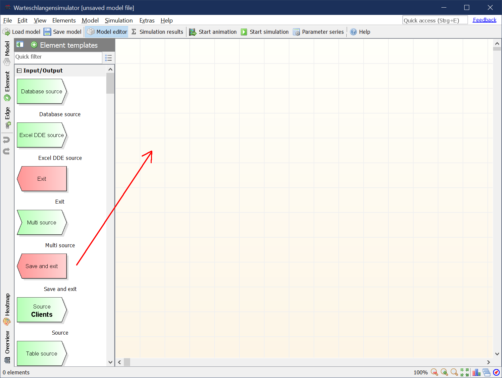
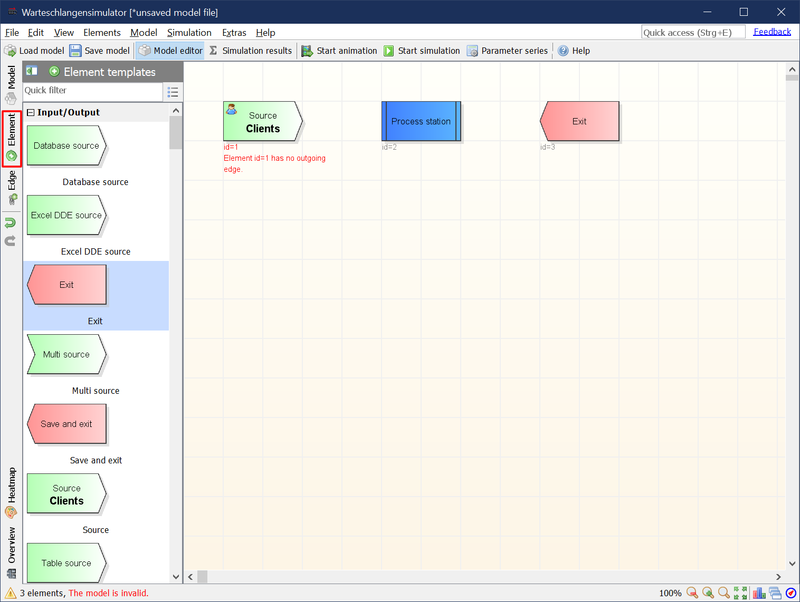
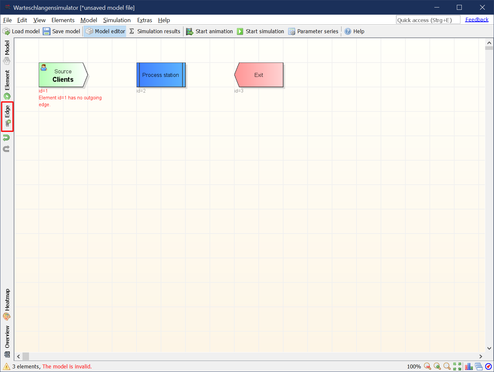
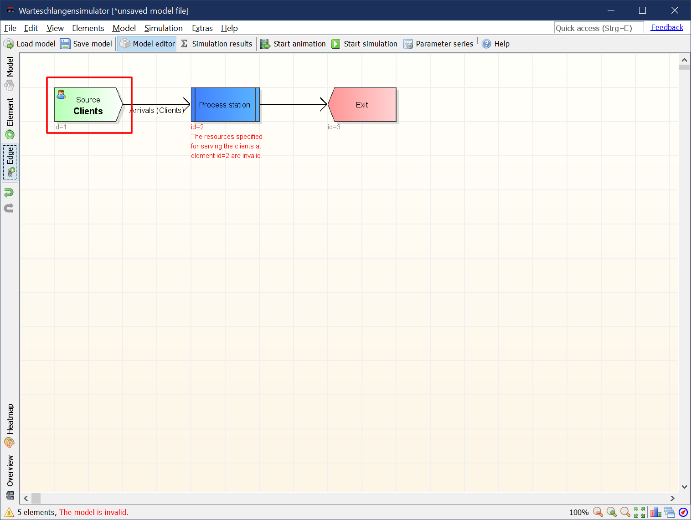
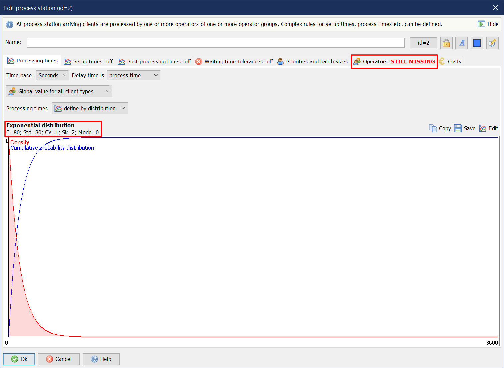
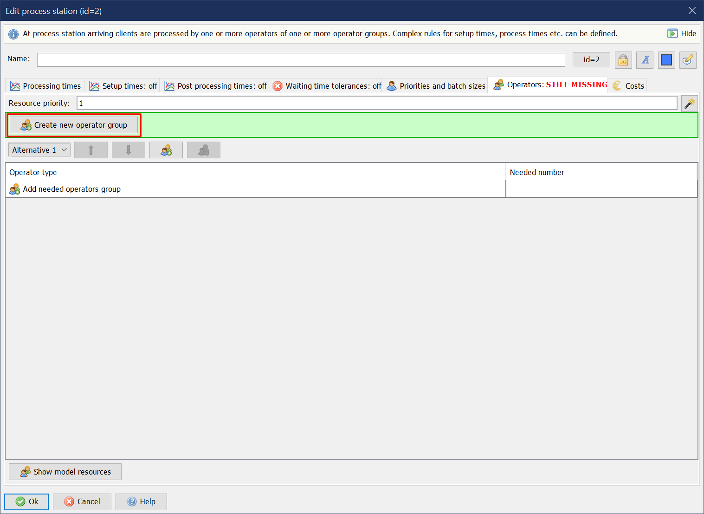
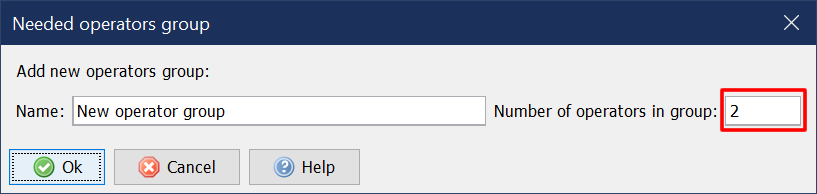

# Warteschlangensimulator tutorial

This tutorial shows how to create a simple M/M/c queueing model with E[I]=50, E[S]=80 and c=2 in Warteschlangensimulator.

***

## Step 1

In Warteschlangensimulator queueing systems are modelled in form of flow charts. Our model will consist of a source, a process station and an exit element. To add these elements to the drawing surface open the element templates panel by clicking on "Element" on the left toolbar.

***

## Step 2

Drag and drop a "Source", a "Process station" and an "Exit" to the drawing surface.

***

## Step 3

After adding the elements again click on "Element" to close the templates panel.

***

## Step 4

As next step, the three stations need to be connected. Clients created at the source are to be directed to the process station. After being served the clients should leave the system via the exit station. To activate the connections adding function click on the "Edge" button on the left toolbar.

***

## Step 5

Edges are added by clicking the source and then the destination element of a connection. So click on "Source" and then on "Process station". After adding the first edge click on "Process station" and then on "Exit" to add the second connection.

***

## Step 6

After adding the connections deactivate the connections adding function by clicking the "Edge" button on the left toolbar again.

***

## Step 7

Now the stations need to be configured. To define the properties of the source, double click on the source station.

***

## Step 8

In the default case the exponential distribution with an average inter-arrival time of 60 seconds is chosen. We want an **average inter-arrival time of 50 seconds**, so we click on "Edit" and change the average inter-arrival time.

***

## Step 9

After closing the distribution editor the new inter-arrival time is shown in the source properties dialog. The dialog can be closed by clicking "Ok" now.

***

## Step 10

As the last step the process station needs to be configured. By double clicking the process station element the properties dialog for this station can be opened.

***

## Step 11

In the default case the exponential distribution with an average service time of 50 seconds is chosen. We want an **average service time of 80 seconds**, so we click on "Edit" and change the average service time.

***

## Step 12

After closing the distribution editor the new service time is shown in the process station properties dialog. To make the process station work, we need to add operators as the last step. Therefore the "Operators" dialog page needs to be activated.

***

## Step 13

There are no operator groups in the system at the moment. So we need to create an operator group and assign it to the process station. This can be done by clicking "Create new operator group".

***

## Step 14

In the dialog for creating a new operator group the group size (the number of available operators in this group) can be specified. Because we want to create a M/M/c system with c=2, we enter a **group size of 2**.

***

## Step 15

Two operators are available in the group and one is needed to serve a client. That's all. The dialog can be closed by clicking "Ok" now.

***

## Step 16

The model can be animated or simulated now by clicking "Start animation" or "Start simulation" on the toolbar.

